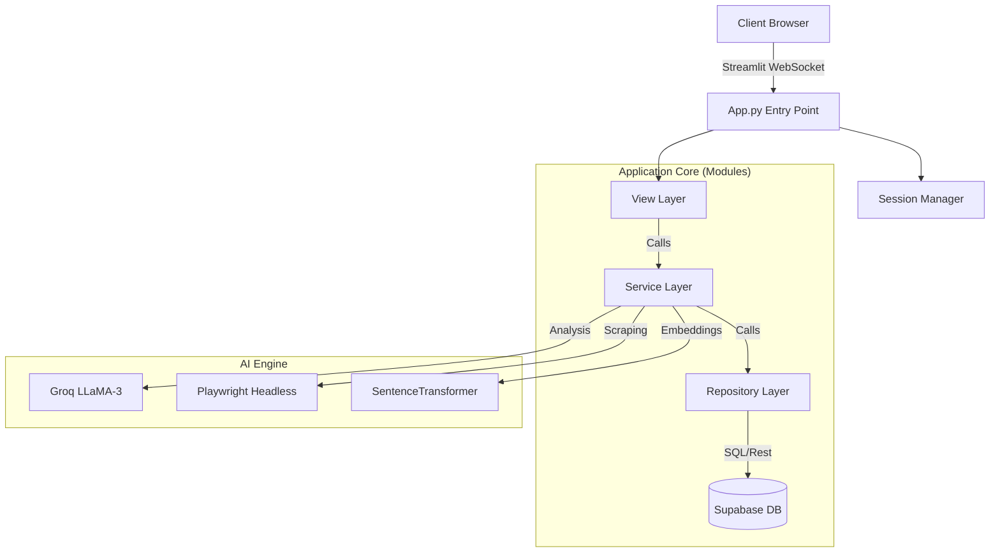

# 🏗️ Architecture Documentation

## System Overview

AudiencePulse is a modular, event-driven web application built with Streamlit, Supabase, and Python.

## Module System (DDD)

The codebase is refactored into domain-specific modules for scalability:

| Module                  | Responsibility                              | Key Classes                             |
| :---------------------- | :------------------------------------------ | :-------------------------------------- |
| **`modules/campaigns`** | Manages user projects and creator rosters.  | `CampaignService`, `CampaignRepository` |
| **`modules/creators`**  | Core creator profiles, audits, and scoring. | `CreatorService`, `CreatorRepository`   |
| **`modules/compare`**   | Engine for head-to-head creator analysis.   | `CompareViews`                          |
| **`modules/reports`**   | Visual report generation (PDF/Charts).      | `ReportService`                         |
| **`modules/core`**      | Singletons for Config, DB, and Session.     | `AppConfig`, `SessionManager`           |

## Database Schema

### `auth.users`

Managed by Supabase Auth. We link to this via `user_email` or `user_id`.

### `public.campaigns`

- `id`: UUID (PK)
- `user_email`: String (Owner)
- `name`: String
- `description`: Text
- `created_at`: Timestamp

### `public.audit_logs`

- `id`: UUID (PK)
- `url`: String (Video URL)
- `creator_name`: String
- `platform`: String (e.g., "youtube")
- `final_score`: Integer (0-100)
- `analysis_json`: JSONB (Full reports)
- `campaign_id`: UUID (FK -> campaigns.id)

## AI Pipeline Workflows

### 1. The Audit Flow

1. **Input**: User provides YouTube Video URL.
2. **Scraping**: `scraper.py` fetches comments + transcript via Playwright.
3. **Analysis**: `analyze_groq.py` chunks comments and sends to LLaMA-3.
4. **Scoring**: `intelligence.py` calculates Trust/DNA scores.
5. **Storage**: Result stored in `audit_logs` and linked to active Campaign.

### 2. The Battle Flow

1. **Selection**: User picks 2+ creators from Campaign Roster.
2. **Retrieval**: App fetches JSON analysis from `audit_logs`.
3. **Normalization**: Scores are normalized for radar chart comparison.
4. **Rendering**: Plotly overlay charts generated on the fly.
